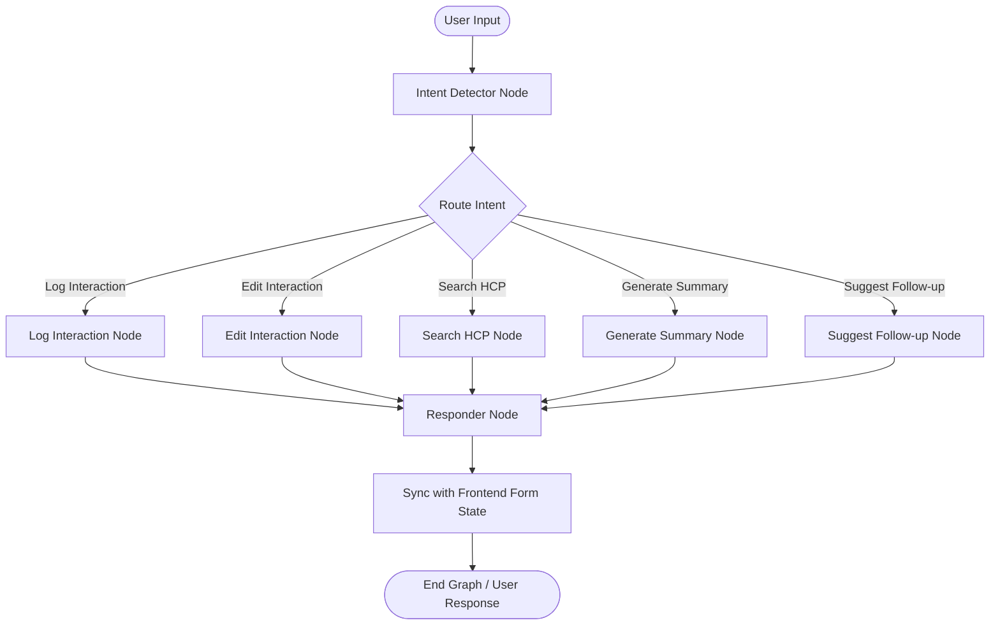

# 🌟 AI-Driven HCP CRM (Healthcare Professional Module)

An intelligent, AI-first Customer Relationship Management (CRM) system designed to optimize and streamline interactions between pharmaceutical representatives and Healthcare Professionals (HCPs). 

This application features a dynamic, multi-agent AI assistant powered by **LangGraph** that extracts key details from natural language visit logs in real-time, auto-populates CRM forms, suggests follow-ups, and generates comprehensive meeting summaries.

---

## 🛠️ Technology Stack

| Layer | Technology | Key Libraries / Frameworks |
| :--- | :--- | :--- |
| **Frontend** | React (v19) | Vite, TailwindCSS (v3), Redux Toolkit, React Router DOM, React Hook Form, Lucide React, Axios |
| **Backend** | Python (v3.10+) | FastAPI, Uvicorn, LangGraph, LangChain, SQLAlchemy |
| **Database** | PostgreSQL | Psycopg2 |
| **AI Models** | Groq / OpenAI | Gemma 2 (9B), GPT-4o / GPT-3.5 |

---

## 🏛️ Architecture & AI Agent Flow

The core highlight of this system is the **AI Chat Assistant** running on a **LangGraph state graph**. When a representative writes a meeting narrative (e.g., *"I visited Dr. Ravi today at City General and distributed 5 samples of GlucoSafe. He was happy with it..."*), the graph processes it as follows:



1. **Intent Detector**: Analyzes the input to route the user's intent. If logging, it extracts entities (doctor name, products discussed, samples, dates) using Groq.
2. **Action Nodes**: Executes the corresponding tool (e.g., querying database, calculating follow-ups).
3. **Responder**: Formats a natural markdown message for the chat interface and synchronizes the extracted metadata to auto-populate the frontend form.

---

## 📂 Repository Directory Structure

```text
AI-Driven-HCP-CRM/
├── backend/
│   ├── app/
│   │   ├── agents/         # LangGraph AI agent workflow definition and prompts
│   │   ├── api/            # FastAPI routers (HCP, Interaction, Chat endpoints)
│   │   ├── core/           # Configuration files, environment parser, database sessions
│   │   ├── models/         # SQLAlchemy Database models (HCP, Product, Interaction, etc.)
│   │   ├── schemas/        # Pydantic validation schemas
│   │   └── seed.py         # Database seeding script (creates DB & mock data)
│   ├── run.py              # Backend entrypoint script
│   └── requirements.txt    # Python dependencies
├── frontend/
│   ├── public/             # Static public assets
│   ├── src/
│   │   ├── assets/         # App icons and graphics
│   │   ├── components/     # Reusable layout and navigation components
│   │   ├── features/hcp/   # Feature-based pages (Dashboard, Search, Log, Review, History)
│   │   ├── services/       # Axios API client services
│   │   ├── store/          # Redux Toolkit global state store
│   │   └── main.jsx        # App entry point
│   ├── tailwind.config.js  # Styling guidelines
│   ├── vite.config.js      # Vite build config
│   └── package.json        # Frontend scripts and node modules configuration
├── .gitignore              # Global git exclusions
└── README.md               # Main project documentation (this file)
```

---

## 🚀 Setup & Installation Guide

Follow these steps to set up and run the project locally.

### Prerequisites

Ensure you have the following installed on your machine:
* **Python 3.10 or higher**
* **Node.js 18 or higher** (with npm)
* **PostgreSQL** (running locally or remotely)

---

### 1. Backend Setup

1. **Navigate to the backend directory:**
   ```bash
   cd backend
   ```

2. **Create a virtual environment:**
   ```bash
   # On Windows
   python -m venv .venv
   
   # On macOS/Linux
   python3 -m venv .venv
   ```

3. **Activate the virtual environment:**
   ```bash
   # On Windows (CMD)
   .venv\Scripts\activate.bat
   
   # On Windows (PowerShell)
   .venv\Scripts\activate.ps1
   
   # On macOS/Linux
   source .venv/bin/activate
   ```

4. **Install Python dependencies:**
   ```bash
   pip install -r requirements.txt
   ```

5. **Configure Environment Variables:**
   * Copy the `.env.example` file to `.env`:
     ```bash
     cp .env.example .env
     ```
   * Open `.env` and fill in your configuration:
     ```env
     # Backend server configuration
     PROJECT_NAME="AI-First CRM - HCP Module"

     # PostgreSQL Database connection credentials
     POSTGRES_SERVER=localhost
     POSTGRES_USER=postgres
     POSTGRES_PASSWORD=your_postgres_password
     POSTGRES_PORT=5432
     POSTGRES_DB=crm_hcp

     # LLM Settings (Groq API Key is required for LangGraph Agent)
     GROQ_API_KEY=gsk_your_groq_api_key
     GROQ_MODEL=gemma2-9b-it
     ```

6. **Initialize Database & Seed Data:**
   Run the database seed script to auto-create the database (if it doesn't exist), run migrations to build all tables, and seed it with realistic medical/pharmaceutical mock records:
   ```bash
   python app/seed.py
   ```

7. **Start the FastAPI server:**
   ```bash
   python run.py
   ```
   The backend API will start running at `http://localhost:8000`. You can inspect the interactive Swagger API documentation at `http://localhost:8000/docs`.

---

### 2. Frontend Setup

1. **Navigate to the frontend directory:**
   ```bash
   cd ../frontend
   ```

2. **Install Node modules:**
   ```bash
   npm install
   ```

3. **Start the Vite development server:**
   ```bash
   npm run dev
   ```
   The frontend will start running, usually at `http://localhost:5173`. Open this URL in your web browser.

---

## 📈 Database Seed Records

To help you get started immediately, the `app/seed.py` script seeds the following mock entities:

### 💊 Available Products
* **GlucoSafe**: Glycemic control formulation for Type 2 Diabetes.
* **CardioShield**: Next-generation beta-blocker for hypertension.
* **NeuroPlus**: Neuroprotective therapy for Alzheimer's.
* **RespiClear**: Inhaled corticosteroid for asthma/COPD.
* **OsteoBond**: Bisphosphonate therapy for postmenopausal osteoporosis.

### 🩺 Sample Healthcare Professionals (HCPs)
* **Dr. Ravi Kumar** (Diabetologist, Chicago)
* **Dr. Sarah Jenkins** (Cardiologist, New York)
* **Dr. Elena Rostova** (Neurologist, Boston)
* **Dr. Amit Patel** (Pulmonologist, Houston)
* **Dr. Kenji Tanaka** (Orthopedic Specialist, San Francisco)

---

## 🔌 API Endpoints Summary

All routes are versioned under `/api/v1`.

| Method | Endpoint | Description | Tags |
| :--- | :--- | :--- | :--- |
| **GET** | `/` | Health check endpoint | Root |
| **GET** | `/api/v1/hcp` | Search/Retrieve HCP directories | HCP |
| **POST** | `/api/v1/hcp` | Register a new HCP doctor | HCP |
| **GET** | `/api/v1/interaction` | List historical interactions | Interaction |
| **POST** | `/api/v1/interaction` | Log a new interaction manually | Interaction |
| **POST** | `/api/v1/chat` | Route interaction text to LangGraph Agent | AI Chat |

---

## 🧪 Running Tests

To run the backend test suite:
```bash
cd backend
pytest
```
